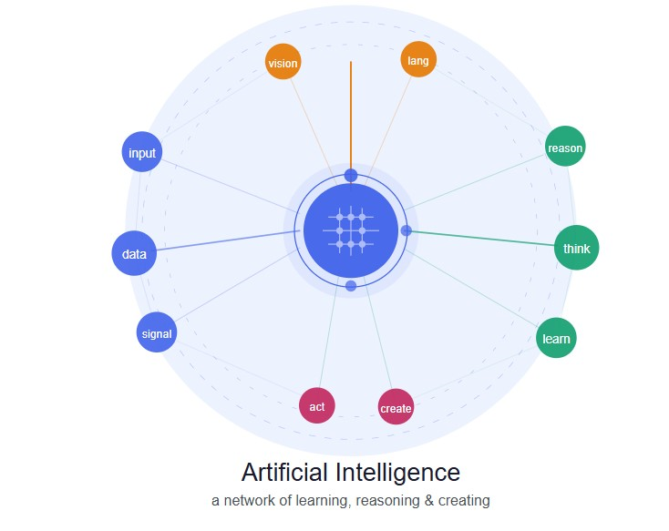
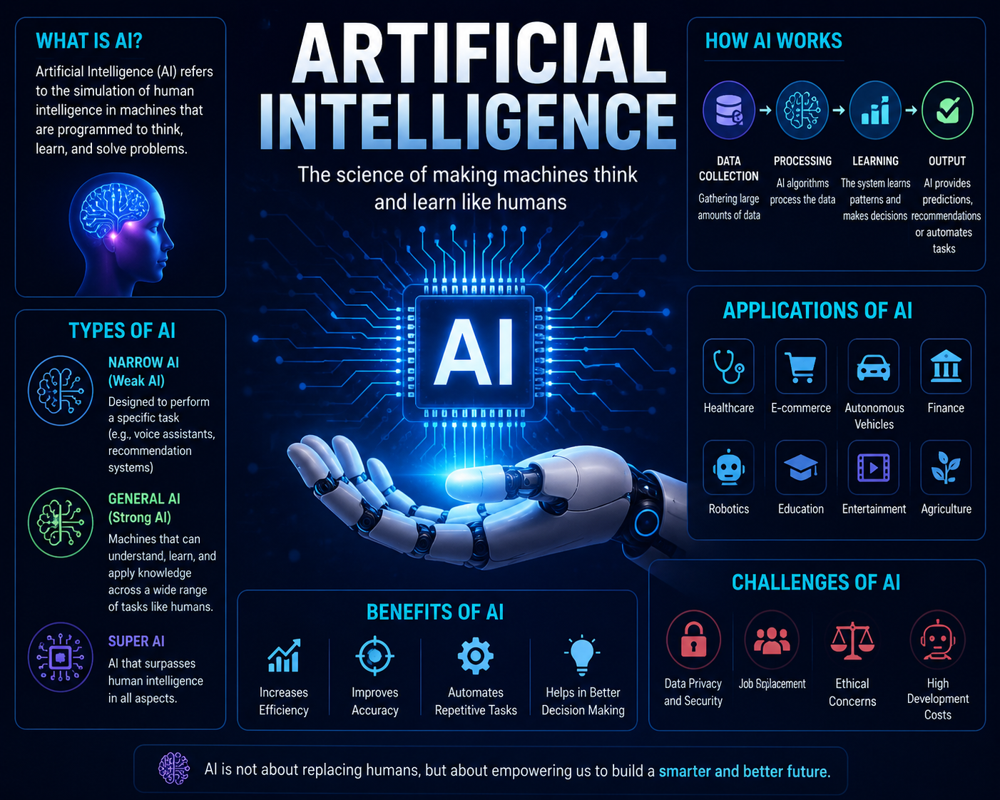
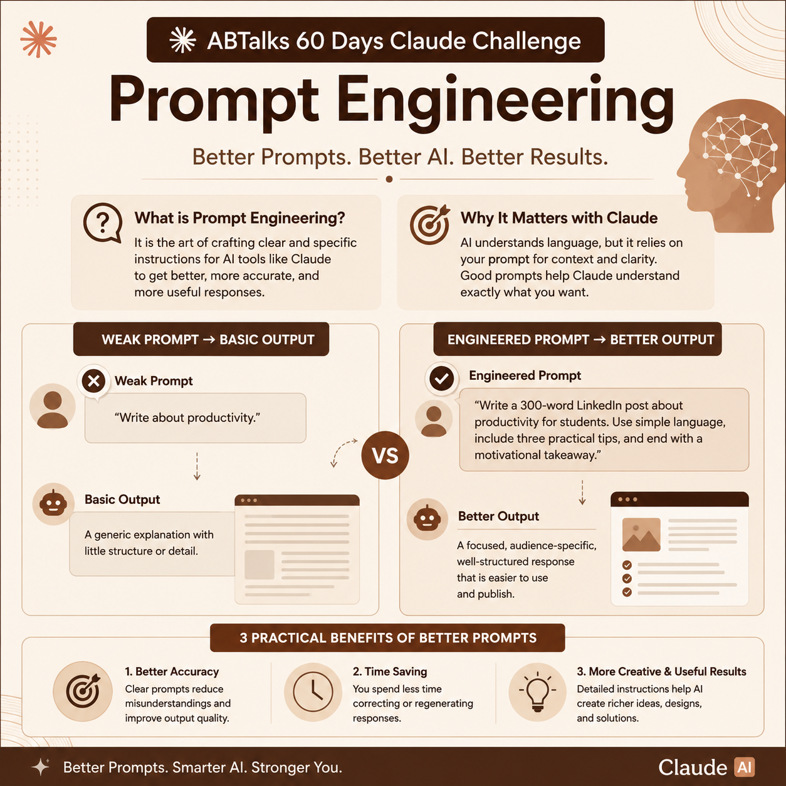

# Day 2 – Prompt Engineering Comparison

## Challenge Objective

The goal of Day 2 was to understand how Prompt Engineering improves AI-generated outputs by comparing a simple prompt with a detailed engineered prompt.

---

# Lazy Prompt

## Prompt Used

Create an image about AI

## Observation

The lazy prompt provided very little context or instruction. As a result, the AI generated a basic output with limited control over style, design, and explanation.

### Lazy Prompt Output

---

# Engineered Prompt

## Prompt Used

Create a high-impact digital artwork titled "The Living Intelligence."

Style: futuristic with subtle surrealism.  
Mood: hopeful, contemplative, technologically elegant.

Central metaphor: AI represented as a living neural ecosystem rather than a humanoid robot.

Composition:
- Cinematic 16:9 layout
- Rule of thirds
- Strong focal hierarchy
- Layered visual depth

Color palette:
- Deep midnight blue
- Electric cyan
- Soft violet
- Warm gold accents

Lighting:
- Central volumetric glow
- Neon edge lighting
- Soft cinematic bloom

Avoid:
- Generic robots
- Dystopian visuals
- Cluttered composition
- Low-detail artwork

## Observation

The engineered prompt produced a significantly better result because it provided clear artistic direction, mood, visual metaphor, composition guidance, and constraints.

The output was more professional, visually appealing, and aligned with the intended concept.

### Engineered Prompt Output

---

# Final LinkedIn Design

After understanding Prompt Engineering, I created a LinkedIn-ready educational design explaining Prompt Engineering using Claude-inspired colors and a structured comparison between weak and engineered prompts.

### Final Design

---

# Weak vs Engineered Prompt Comparison

| Aspect | Lazy Prompt | Engineered Prompt |
|---|---|---|
| Instructions | Minimal | Detailed |
| Context | Missing | Clear |
| Style Guidance | None | Specific |
| Creativity | Limited | Enhanced |
| Output Quality | Basic | Professional |
| Control Over Results | Low | High |

---

# Key Learnings

1. Prompt quality directly affects AI output quality.
2. Clear instructions improve accuracy and relevance.
3. Adding context and constraints creates better results.
4. Prompt Engineering saves time by reducing rework.
5. Structured prompts help AI generate more professional outputs.

---

# What I Worked On

During Day 2, I:

- Tested a lazy AI prompt
- Created an engineered prompt
- Compared both outputs
- Observed differences in quality and structure
- Designed a LinkedIn-ready educational post
- Learned how better prompts improve AI-generated results

---

# Conclusion

Prompt Engineering is the process of giving AI clear, structured, and goal-oriented instructions.

This exercise demonstrated that even small improvements in prompt writing can significantly enhance creativity, clarity, and overall AI performance.

Better prompts lead to better results.
